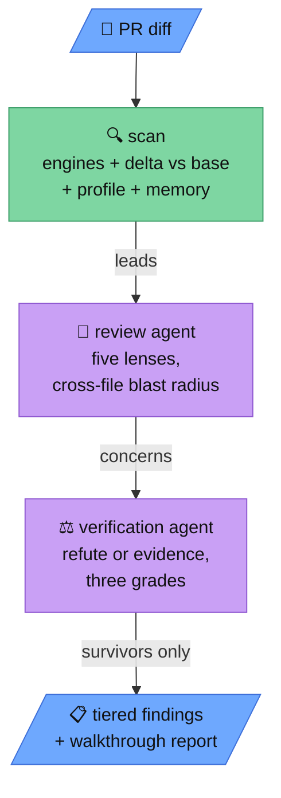

<p align="center">
  
</p>

# Leveret

A leveret is a young hare — small, fast, and born with its eyes open.

Leveret is a self-hosted, hybrid engine for private code reviews: the successor to
hosted AI review bots for teams whose code stays home. It combines a deterministic
static-analysis layer, a code graph built into every checkout, a graded noise filter
with durable memory, and adversarial agent contracts — driven by the AI you bring
(BYOAI: your provider and model — Anthropic or OpenAI by API key or subscription, or
a local OpenAI-compatible endpoint). The engine layer itself never calls an LLM, and
nothing leaves your infrastructure.

## How a review works



1. **Deterministic first pass.** Engines run only against what the change touches:
   semgrep (registry security + per-language rulesets, offline-capable), gitleaks
   (secrets over the commit range), shellcheck, ruff, actionlint, zizmor (workflow
   security), osv-scanner (lockfile CVEs), typos, jscpd (duplication, corpus-gated),
   custom semgrep/ast-grep rule packs, and any SARIF-emitting command via profile
   `custom:` entries ([recipes](docs/recipes.md): psalm taint, hadolint, trivy, …).
   **Delta scanning** is on by default with a base ref: findings already present at
   the base tree are dropped as pre-existing — counted, never silent — with multiset
   identity (a *copy* of a known-bad line still surfaces), rename tracking, and
   surfaced base-pass failures. A code graph is generated into the checkout at the
   exact reviewed commit, so agents query structure instead of grepping for it.
2. **Three-grade filter.** Every lead ends as `actionable`, `priced-noise`
   (true, but the repo has ruled fixing it buys nothing), or `false-positive` —
   assigned cheapest-first by the repo profile (`.leveret.yml`: path scopes,
   severity floors, reasoned suppressions), the memory store, and finally the
   verification agent. Nothing is dropped silently: suppressions come back tallied
   with their reasons.
3. **Memory that learns from humans.** `.leveret/memory.jsonl`, versioned in the
   reviewed repo: fingerprint verdicts (optionally anchored to a source line — the
   memory dies when the line changes) plus **conventions** — free-text rulings
   taught by maintainers via `learn`, injected into the agent prompts as repo case
   law, able both to suppress noise and to *raise* findings that violate them.
4. **Adversarial contracts.** The review agent runs five lenses (correctness and
   hostile inputs, contract conformance, test honesty, blast radius, leads triage)
   and must trace changed symbols to call sites *outside* the diff. The verification
   agent then tries to refute every concern; claims it can neither refute nor ground
   in executed evidence are dropped, not published.
5. **Reporting.** Findings publish in importance tiers (`critical / major / minor /
   nit`, distinct from engine severity), out-of-diff findings appear with their
   stated correlation to the change, pre-existing defects adjacent to edited lines
   return as reminders, and every review carries a walkthrough: per-lens outcomes
   (clean included), per-file verdicts, the engine table, and a run-configuration
   line naming the harness, model, and thinking level that produced the review.

## Ways to run it

**GitHub App (autonomous).** A self-hosted App layer receives PR webhooks, checks
out the head, builds the code graph, runs the scan, drives the standardized runner,
and posts the review — inline comments plus walkthrough. The App holds only a GitHub
App key and webhook secret; model credentials live exclusively in the runner. Human
replies on findings feed `learn`. Getting started + diagram: [docs/app.md](docs/app.md).

**Standardized runner.** `leveret-runner-pi` drives the review/verify contracts
through a pinned [Pi](https://github.com/earendil-works/pi) runtime. Leveret supplies
the system prompt and an exact read-only toolset; Pi supplies the provider/model
runtime. Project settings, extensions, skills, prompt templates, context files and
sessions are not discovered. You choose provider, model, and effort (`--model` /
`--effort` / `--provider`, or the matching `LEVERET_RUNNER_*` env vars; defaults
`openai/gpt-5.6-sol` at `high`). Every walkthrough records the effective client,
model, prompt hash, capabilities, and tool metrics. A custom `LEVERET_RUNNER`
remains the bring-your-own-harness escape hatch.

**Interactive (MCP).** Register the server in any MCP-capable client and drive
reviews yourself — the served `review`/`verify` prompts arrive with your repo's
accumulated rulings substituted in (getting started + diagram:
[docs/interactive.md](docs/interactive.md)):

```sh
npm install && npm run build
claude mcp add leveret -- node /path/to/leveret/dist/server.js
```

MCP tools: `scan`, `ast_search` (structural search via ast-grep), `context`
(per-function complexity, churn, recency — prioritization signal, not findings),
`remember` (persist a graded verdict), `memory` (inspect the store), `learn`
(persist a human-taught convention); MCP prompts: `review`, `verify`.

## The reviewer toolbelt

The engines and the code graph are capabilities of the reviewer, not the reviewed
repository: install them beside Leveret. Full belt: `codegraph`, `semgrep`,
`gitleaks`, `shellcheck`, `ruff`, `actionlint`, `zizmor`, `osv-scanner`, `typos`,
`jscpd`, `ast-grep`, `lizard`, and a pre-staged Serena LSP bundle for semantic
navigation. From a clone, build one with
`node dist/runner/prefetch-serena.js --bundle /opt/leveret/serena-bundle` and run
with `LEVERET_SERENA_BUNDLE` set to that path (the installed package also exposes
`leveret-prefetch-serena`). Runtime downloads are refused. A missing tool degrades
loudly — the walkthrough reports which surfaces were live.

```sh
npm test        # integration suite; exercises the real tools
```

## Design and status

[DESIGN.md](DESIGN.md) holds the architecture and decisions: the three-grade
filter, memory and learnings, runner standardization, the GitHub App split, and the
validation benchmark that gates replacing a hosted review bot with Leveret.

## License

[AGPL-3.0-or-later](LICENSE).
