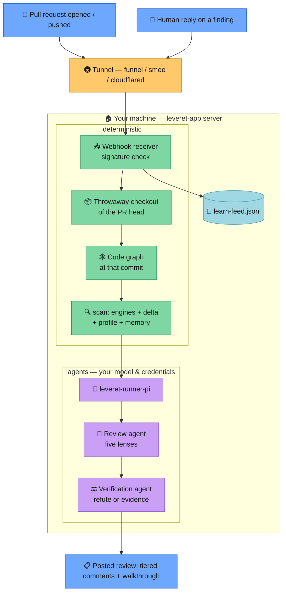

# Leveret as a GitHub App

Autonomous reviews: install once, every pull request gets reviewed. Start with
[Getting started](#getting-started); the [How it works](#how-it-works) section
explains the moving parts and has the diagram.

## Getting started

Prerequisites: Node 22.19+, git, the [reviewer toolbelt](../README.md#the-reviewer-toolbelt),
and provider credentials accepted by [Pi](https://github.com/earendil-works/pi).

**1. Build:**

```sh
git clone https://github.com/leveret-dev/leveret && cd leveret
npm install && npm run build
```

Authenticate once for subscription OAuth, if applicable:

```sh
npx pi
# run /login, then exit
```

Pi stores credentials in `~/.pi/agent/auth.json` (or
`$LEVERET_PI_AGENT_DIR/auth.json`). OAuth tokens refresh there automatically when
expired. Keep the directory private and the file mode `0600`; headless reviews read
the provisioned credentials and never launch the login UI. API-key environment
variables remain supported. The runner disables model-catalog refreshes and never
passes these credentials to tools.

For a keyless local OpenAI-compatible server, add a provider to
`$LEVERET_PI_AGENT_DIR/models.json` (Pi requires only a non-secret placeholder):

```json
{"providers":{"local":{"baseUrl":"http://127.0.0.1:11434/v1","api":"openai-completions","apiKey":"local","models":[{"id":"qwen2.5-coder:7b"}]}}}
```

Then run with `--provider local --model qwen2.5-coder:7b`. The model request is the
only network path Pi needs; tool/update/package networks remain disabled.

Optionally stage the curated Serena LSP bundle during installation. This command
performs downloads now; reviews refuse runtime LSP downloads:

```sh
node dist/runner/prefetch-serena.js --bundle /opt/leveret/serena-bundle
```

The initial self-contained bundle covers TypeScript/JavaScript, PHP (including
project-scoped `.inc`), Bash, YAML, and JSON. The manifest pins each absolute
server executable under `LEVERET_SERENA_BUNDLE`; prefetch fails instead of advertising a
language backed only by a host toolchain or uvx cache. Python, C/C++, Go, Rust, and
Java remain explicitly unavailable until their executables/runtimes are packaged.

**2. Make the machine reachable for webhooks** (pick one):

Tailscale (recommended — stable URL, nothing else to run):

```sh
tailscale funnel --bg 8090
```

smee.io (quick test — needs the relay running):

```sh
npx -y smee-client -u https://smee.io/YOUR_CHANNEL -t http://127.0.0.1:8090/
```

cloudflared:

```sh
cloudflared tunnel --url http://127.0.0.1:8090
```

**3. Start the server** with the public URL from step 2:

```sh
LEVERET_PUBLIC_URL=https://YOUR-PUBLIC-URL \
LEVERET_RUNNER="node $PWD/dist/runner/pi.js" \
LEVERET_SERENA_BUNDLE=/opt/leveret/serena-bundle \
node dist/app/server.js
```

**4. Create your App:** open `https://YOUR-PUBLIC-URL/setup` in a browser (tunnels
proxy the whole server, setup page included). Only with smee — which relays
webhooks, nothing else — browse the server directly instead:
`http://SERVER-ADDRESS:8090/setup`, where SERVER-ADDRESS is `127.0.0.1` on the
machine itself or its LAN/VPN address from elsewhere. (Add `?org=NAME` to the setup
URL for an organization-owned App — it also pre-fills the name.)

The page asks for your account or organization handle, because GitHub App names are
unique across all of GitHub: only one App anywhere can be called plain `Leveret`.
Leading with the word is what keeps the branding — `Leveret acme` posts its reviews
as `leveret-acme[bot]`. Click **Create the App on GitHub** and confirm (GitHub's own
screen lets you edit the name once more).

Back on the server, the confirmation page has the last two steps: upload the Leveret
logo as the App's avatar — GitHub App manifests carry no avatar field, so this one is
manual, and it is the logo that appears beside every review comment — and install the
App on your repositories.

**5. Open a pull request.** Done — the review arrives as inline comments plus a
walkthrough summary.

Optional runner tuning (details in [How it works](#how-it-works)):

```sh
LEVERET_RUNNER="node $PWD/dist/runner/pi.js --provider openai --model gpt-5.6-sol --effort high"
```

## How it works



The pieces, top to bottom:

- **Webhook receiver.** GitHub sends every PR event to your public URL; the tunnel
  forwards it to the local server, which verifies the HMAC signature (the webhook
  secret from setup) and acknowledges immediately. Only two event types are
  subscribed: pull requests and replies on review comments.
- **Checkout, graph, scan.** The server clones the PR head into a temp directory,
  generates the code graph at exactly that commit (the graph is Leveret's own
  capability — the reviewed repo needs nothing), and runs the deterministic engines
  with delta scanning against the base: only findings the change introduced
  survive, with everything dropped accounted for.
- **The runner.** `leveret-runner-pi` drives two agent phases through a pinned Pi
  runtime — the review agent (five lenses, cross-file blast radius via the graph)
  and the verification agent (tries to refute every concern; unverifiable claims
  are dropped). Leveret supplies an explicit system prompt and tool allowlist;
  project settings, prompts, extensions, skills and context files are never loaded.
  Your provider credentials live only here; the App layer and child tools never see
  them. The walkthrough records the client, model, prompt hash, live capabilities,
  and tool metrics.
- **The review.** In-diff findings become inline comments grouped by tier;
  out-of-diff findings, reminders, coverage, and the engine table land in the
  walkthrough summary.
- **The learn feed.** Human replies on findings are captured raw to
  `learn-feed.jsonl` in the data dir; an agent session later ingests rulings into
  the repo's review memory via the `learn` tool.

Credentials on disk (`~/.leveret-app`, mode 0600): App ID, private key, webhook
secret — all owned by you, created by the setup flow, never leaving the machine.

### Manual App creation (alternative to /setup)

1. GitHub → Settings → Developer settings → GitHub Apps → New GitHub App.
2. Name it `Leveret <your-handle>` (names are globally unique; the prefix is what
   keeps reviews signed `leveret-…[bot]`), and upload `assets/logo.png` as the
   avatar. Webhook URL: your public URL from step 2; set a webhook secret
   (`openssl rand -hex 32`).
3. Repository permissions: **Pull requests: Read & write**, **Contents: Read-only**.
   Events: **Pull request**, **Pull request review comment**.
4. Create, note the App ID, generate a private key, install on your repos.
5. Start the server with explicit credentials (env beats stored):

```sh
LEVERET_APP_ID=12345 \
LEVERET_PRIVATE_KEY_PATH=/path/to/app.pem \
LEVERET_WEBHOOK_SECRET=... \
LEVERET_RUNNER="node $PWD/dist/runner/pi.js" \
LEVERET_SERENA_BUNDLE=/opt/leveret/serena-bundle \
node dist/app/server.js
```

### Runner reference

`leveret-runner-pi` accepts CLI args (or `LEVERET_RUNNER_*` env vars; CLI wins):

| flag | env | default |
| --- | --- | --- |
| `--model` | `LEVERET_RUNNER_MODEL` | `gpt-5.6-sol` |
| `--effort` | `LEVERET_RUNNER_EFFORT` | `high` |
| `--provider` | `LEVERET_RUNNER_PROVIDER` | `openai` |
| `--max-time` | `LEVERET_RUNNER_MAX_TIME` | `30m` per phase |

Pi runs from in-memory settings/session with a Leveret-owned resource loader and
an exact tool allowlist. No project-local settings, extensions, skills, templates,
themes, context files, MCP configuration, system prompts, or executable discovery
can extend it. `PI_OFFLINE=1`, `PI_TELEMETRY=0`, and
`PI_SKIP_VERSION_CHECK=1` are enforced by the runner. A custom `LEVERET_RUNNER`
command is the escape hatch for other harnesses; it receives
`LEVERET_REPO`, `LEVERET_BASE`, `LEVERET_LEADS`, `LEVERET_GRAPH` and must print
the verify-output JSON (see `agents/verify.md`).

For autonomous reviews, `.leveret.yml` and `.leveret/memory.jsonl` are read from
the trusted base commit, not the pull-request head. Custom profile engines are not
executed by the App/Pi path; use built-in engines or an explicitly sandboxed custom
harness.

The Pi reviewer can read those trusted rulings but cannot write new ones. Its
verdicts are retained in the run artifact, while versioned repo memory and human
replies through the learn feed remain the durable write paths. A reviewed checkout
therefore cannot teach future reviews through prompt injection.

Serena starts only when `LEVERET_SERENA_BUNDLE` contains
`leveret-lsp-manifest.json`, created by the prefetch command. Leveret creates and
sets a fresh `SERENA_HOME` inside the per-review temporary runtime directory. Its
dashboard, HTTP stats endpoint, GUI, tray process, and anonymous usage reporting
are disabled. Metrics are captured durably by the Pi adapter.

Without any runner configured, reviews are deterministic-only: engine findings
post directly and the walkthrough says the agent lenses did not run.
