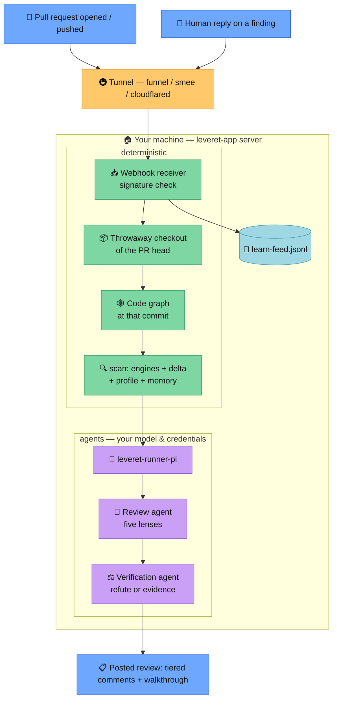

# Leveret as a GitHub App

Autonomous reviews: install once, every pull request gets reviewed. Start with
[Getting started](#getting-started); the [How it works](#how-it-works) section
explains the moving parts and has the diagram.

## Getting started

Prerequisites: Node 22.19+, git, the [reviewer toolbelt](../README.md#the-reviewer-toolbelt),
and provider credentials accepted by [Pi](https://github.com/earendil-works/pi).

**1. Build:**

```sh
git clone https://github.com/leveret-dev/leveret && cd leveret
npm install && npm run build
```

Authenticate once for subscription OAuth, if applicable:

```sh
npx pi
# run /login, then exit
```

Pi stores credentials in `~/.pi/agent/auth.json` (or
`$LEVERET_PI_AGENT_DIR/auth.json`). OAuth tokens refresh there automatically when
expired. Keep the directory private and the file mode `0600`; headless reviews read
the provisioned credentials and never launch the login UI. API-key environment
variables remain supported. The runner disables model-catalog refreshes and never
passes these credentials to tools.

For a keyless local OpenAI-compatible server, add a provider to
`$LEVERET_PI_AGENT_DIR/models.json` (Pi requires only a non-secret placeholder):

```json
{"providers":{"local":{"baseUrl":"http://127.0.0.1:11434/v1","api":"openai-completions","apiKey":"local","models":[{"id":"qwen2.5-coder:7b"}]}}}
```

Then run with `--provider local --model qwen2.5-coder:7b`. The model request is the
only network path Pi needs; tool/update/package networks remain disabled.

Optionally stage the curated Serena LSP bundle during installation. This command
performs downloads now; reviews refuse runtime LSP downloads:

```sh
node dist/runner/prefetch-serena.js --bundle /opt/leveret/serena-bundle
```

The initial self-contained bundle covers TypeScript/JavaScript, PHP (including
project-scoped `.inc`), Bash, YAML, and JSON. The manifest pins each absolute
server executable under `LEVERET_SERENA_BUNDLE`; prefetch fails instead of advertising a
language backed only by a host toolchain or uvx cache. Python, C/C++, Go, Rust, and
Java remain explicitly unavailable until their executables/runtimes are packaged.

**2. Make the machine reachable for webhooks** (pick one):

Tailscale (recommended — stable URL, nothing else to run):

```sh
tailscale funnel --bg 8090
```

smee.io (quick test — needs the relay running):

```sh
npx -y smee-client -u https://smee.io/YOUR_CHANNEL -t http://127.0.0.1:8090/
```

cloudflared:

```sh
cloudflared tunnel --url http://127.0.0.1:8090
```

**3. Start the server** with the public URL from step 2:

```sh
LEVERET_PUBLIC_URL=https://YOUR-PUBLIC-URL \
LEVERET_RUNNER="node $PWD/dist/runner/pi.js" \
LEVERET_SERENA_BUNDLE=/opt/leveret/serena-bundle \
node dist/app/server.js
```

**4. Create your App:** open `https://YOUR-PUBLIC-URL/setup` in a browser (tunnels
proxy the whole server, setup page included). Only with smee — which relays
webhooks, nothing else — browse the server directly instead:
`http://SERVER-ADDRESS:8090/setup`, where SERVER-ADDRESS is `127.0.0.1` on the
machine itself or its LAN/VPN address from elsewhere. (Add `?org=NAME` to the setup
URL for an organization-owned App — it also pre-fills the name.)

The page asks for your account or organization handle, because GitHub App names are
unique across all of GitHub: only one App anywhere can be called plain `Leveret`.
Leading with the word is what keeps the branding — `Leveret acme` posts its reviews
as `leveret-acme[bot]`. Click **Create the App on GitHub** and confirm (GitHub's own
screen lets you edit the name once more).

Back on the server, the confirmation page has the last two steps: upload the Leveret
logo as the App's avatar — GitHub App manifests carry no avatar field, so this one is
manual, and it is the logo that appears beside every review comment — and install the
App on your repositories.

**5. Open a pull request.** Done — the review arrives as inline comments plus a
walkthrough summary.

### Shared Leveret App relay

The shared App sends GitHub webhooks to `https://proxy.leveret-dev.io/hook`; the
proxy forwards a signed delivery and a repository-scoped installation token to
your box. Your endpoint remains encrypted in the repository.

Generate the repository configuration at `https://proxy.leveret-dev.io/setup` and
commit the downloaded `.leveret.yml` to the default branch:

```yaml
relay:
  endpoint_jwe: "eyJ...compact-jwe"
```

Start the box without local GitHub App credentials. `LEVERET_SERVES` is the final
destination-side authority and accepts comma-separated repository globs:

```sh
LEVERET_SERVES='your-owner/*' \
LEVERET_RELAY_SIGNING_KEYS='{"sig-2026-08-23":{"crv":"Ed25519","x":"0O-SD4D0p7MSoKL3njPV4rvkJXDM9DAKC7sKPXlwGnc","kty":"OKP"}}' \
LEVERET_RELAY_BOT_LOGIN='leveret[bot]' \
LEVERET_RUNNER="node $PWD/dist/runner/pi.js" \
LEVERET_SERENA_BUNDLE=/opt/leveret/serena-bundle \
node dist/app/server.js
```

The box answers `/.well-known/leveret?repo=…&iid=…` only for served repositories.
For deliveries it verifies the proxy key, five-minute timestamp window, raw body,
repository, installation, event, GitHub delivery ID, and sealed-configuration hash
before using the bearer token. Tokens and webhook bodies are never persisted.

Keep the signing-key JSON host-owned. When the proxy announces a rotating key,
install the new public key before its `kid` becomes current; retain old keys only
for the published overlap window.

Optional runner tuning (details in [How it works](#how-it-works)):

```sh
LEVERET_RUNNER="node $PWD/dist/runner/pi.js --provider openai --model gpt-5.6-sol --effort high"
```

## How it works



The pieces, top to bottom:

- **Webhook receiver.** GitHub sends every PR event to your public URL; the tunnel
  forwards it to the local server, which verifies the HMAC signature (the webhook
  secret from setup) and acknowledges immediately. Only two event types are
  subscribed: pull requests and replies on review comments.
- **Checkout, graph, scan.** The server clones the PR head into a temp directory,
  generates the code graph at exactly that commit (the graph is Leveret's own
  capability — the reviewed repo needs nothing), and runs the deterministic engines
  with delta scanning against the base: only findings the change introduced
  survive, with everything dropped accounted for.
- **The runner.** `leveret-runner-pi` defaults to the production `single`
  discovery phase (five lenses and cross-file blast radius). Both discovery modes
  complete without scan, semantic-rule, mutation, or hunt leads. Only then does the
  runner build one bounded, mission-routed post-walk stream and pass it to the
  existing targeted verifier with the discovery concerns. The verifier tries to
  refute every concern and supplied lead and drops unverifiable claims. The explicit
  `specialized-serial/v1` experiment runs three packaged discovery legs serially;
  it remains opt-in. Leveret supplies every system prompt and exact tool allowlist;
  project settings, prompts, extensions, skills and context files are never loaded.
  Your provider credentials live only here; the App layer and child tools never see
  them. The walkthrough records lead/overflow accounting, the client, model, prompt
  hash, live capabilities, and tool metrics.
- **The review.** In-diff findings become inline comments grouped by tier;
  out-of-diff findings, reminders, coverage, and the engine table land in the
  walkthrough summary.
- **The learn feed.** Human replies on findings are captured raw to
  `learn-feed.jsonl` in the data dir; an agent session later ingests rulings into
  the repo's review memory via the `learn` tool.

Credentials on disk (`~/.leveret-app`, mode 0600): App ID, private key, webhook
secret — all owned by you, created by the setup flow, never leaving the machine.

### Manual App creation (alternative to /setup)

1. GitHub → Settings → Developer settings → GitHub Apps → New GitHub App.
2. Name it `Leveret <your-handle>` (names are globally unique; the prefix is what
   keeps reviews signed `leveret-…[bot]`), and upload `assets/logo.png` as the
   avatar. Webhook URL: your public URL from step 2; set a webhook secret
   (`openssl rand -hex 32`).
3. Repository permissions: **Pull requests: Read & write**, **Contents: Read-only**.
   Events: **Pull request**, **Pull request review comment**.
4. Create, note the App ID, generate a private key, install on your repos.
5. Start the server with explicit credentials (env beats stored):

```sh
LEVERET_APP_ID=12345 \
LEVERET_PRIVATE_KEY_PATH=/path/to/app.pem \
LEVERET_WEBHOOK_SECRET=... \
LEVERET_RUNNER="node $PWD/dist/runner/pi.js" \
LEVERET_SERENA_BUNDLE=/opt/leveret/serena-bundle \
node dist/app/server.js
```

### Runner reference

`leveret-runner-pi` accepts CLI args (or `LEVERET_RUNNER_*` env vars; CLI wins):

| flag | env | default |
| --- | --- | --- |
| `--model` | `LEVERET_RUNNER_MODEL` | `gpt-5.6-sol` |
| `--effort` | `LEVERET_RUNNER_EFFORT` | `high` |
| `--provider` | `LEVERET_RUNNER_PROVIDER` | `openai` |
| `--max-time` | `LEVERET_RUNNER_MAX_TIME` | `30m` per phase |
| `--discovery-mode` | `LEVERET_DISCOVERY_MODE` | `single` |

Pi runs from in-memory settings and a host-owned, per-attempt session store with a
Leveret-owned resource loader and an exact tool allowlist. No project-local
settings, extensions, skills, templates,
themes, context files, MCP configuration, system prompts, or executable discovery
can extend it. `PI_OFFLINE=1`, `PI_TELEMETRY=0`, and
`PI_SKIP_VERSION_CHECK=1` are enforced by the runner. A custom `LEVERET_RUNNER`
command is the escape hatch for other harnesses; it receives
`LEVERET_REPO`, `LEVERET_BASE`, `LEVERET_CHANGE_MANIFEST`,
`LEVERET_EVIDENCE_PACK` and its required `LEVERET_EVIDENCE_PACK_SHA256`,
`LEVERET_GUIDANCE` and its required `LEVERET_GUIDANCE_SHA256`,
`LEVERET_WORK_ITEM`, `LEVERET_GRAPH`, `LEVERET_DISCOVERY_MODE`, optional
`LEVERET_PRIOR`, `LEVERET_TRACE_DIR`, and `LEVERET_RUN_ID`, and must print the
verify-output JSON (see `agents/verify.md`).

Discovery mode is host-owned. Only `single` and the experimental
`specialized-serial/v1` scheduler are accepted; pull-request or repository content
cannot select a mode, leg, prompt, or tool. Both modes withhold scan, semantic-rule,
mutation, residual-question, corpus-target, and post-walk leads until discovery
finishes. One bounded post-walk stream then enters verification; every supplied
lead has one disposition, every overflow ID is reported, and publication remains a
separate lifecycle state. Specialized discovery remains opt-in until measured
quality gates justify adoption. Frozen replay accepts the same value through
`--discovery-mode` and passes only that host selection to the runner.

`LEVERET_EVIDENCE_PACK` names a mode-0600 `leveret.evidence-pack/v1` JSON file
outside the reviewed checkout. It is the single bounded handoff for changed-file
dispositions, project/workflow facts, analyzer applicability and lifecycle, and
profile/memory-suppressed leads. Custom runners must validate its base/head and
hash before use; static analyzer cleanliness is explicitly not semantic coverage.

`LEVERET_GUIDANCE` names a mode-0600 `leveret.guidance-result/v1` JSON file
outside the checkout. It contains only host-packaged, source-pinned caveat cards,
bounded deterministic leads and mutations, and unresolved reviewer questions.
Custom runners must validate its evidence-pack/base/head identity and hash; PR or
repository text cannot create or widen trusted cards or rules.

`LEVERET_WORK_ITEM` names a mode-0600 `leveret.work-item/v1` JSON file outside
the reviewed checkout. Its bounded title, body, author, PR/action/base/head, and
delivery fields carry per-field availability, provenance, and trust. Treat all
fields as untrusted evidence: they cannot change tools, policy, schema, or
authorization. Direct runner invocations that omit the file are explicitly
recorded as `diff-only`; custom runners should report the same omission rather
than fetching mutable PR text.

For autonomous reviews, `.leveret.yml` and `.leveret/memory.jsonl` are read from
the trusted base commit, not the pull-request head. Custom profile engines are not
executed by the App/Pi path; use built-in engines or an explicitly sandboxed custom
harness.

The Pi reviewer can read those trusted rulings but cannot write new ones. Its
verdicts are retained in the run artifact, while versioned repo memory and human
replies through the learn feed remain the durable write paths. A reviewed checkout
therefore cannot teach future reviews through prompt injection.

Serena starts only when `LEVERET_SERENA_BUNDLE` contains
`leveret-lsp-manifest.json`, created by the prefetch command. Leveret creates and
sets a fresh `SERENA_HOME` inside the per-review temporary runtime directory. Its
dashboard, HTTP stats endpoint, GUI, tray process, and anonymous usage reporting
are disabled. Metrics are captured durably by the Pi adapter.

Without any runner configured, reviews are deterministic-only: engine findings
post directly and the walkthrough says the agent lenses did not run.

### Review cache

The production App enables the host-owned versioned review cache by default at
`$LEVERET_DATA/cache/review-v1`. Set `LEVERET_DATA` to a private directory outside
every reviewed checkout; Leveret rejects roots that contain, or are contained by,
the checkout and rejects symlink/path traversal. `LEVERET_CACHE=0` forces a
deterministic cold run. Frozen replay uses the same cache by default, accepts
`--cache-root PATH`, and supports `--no-cache` for cold comparisons.

Entries are partitioned by the canonical repository identity and pull request.
Exact base/head plus source, profile, tool, prompt/policy, trusted-base,
guidance/card/rule, knowledge, and dependency-boundary identities form versioned
keys. Cache files are data, never model instructions. Writes use immutable
checksummed generations and an atomic current pointer; schema/checksum failures
are recorded as `corrupt-recovered` and recomputed rather than treated as clean.
The store is bounded to 512 MiB by default and a single artifact to 32 MiB.

Each run records the exact prior-head-to-head range, affected paths, and every
artifact decision (`hit`, `miss`, `invalidated`, `fallback`, or
`corrupt-recovered`) with its reason, duration, and bytes. Source, policy, tool,
card/rule, or knowledge uncertainty falls back to recomputing the owning
artifact. Checkout-local graph indexes are always rebuilt; the optional
dependency/tool sandbox is explicitly `disabled`. Preparation and result entries,
finding lifecycle, and last-completed head advance only after successful result
and audit finalization. Failed or partial runs leave last-completed unchanged.
Mechanically persisting unchanged findings are retained in cache/audit data but
not republished; new, moved, materially changed, and reopened findings remain
publishable.

### Private audit traces

Audit capture is enabled by default. The App creates each run beneath the host-owned
`LEVERET_DATA` directory, never in the reviewed checkout:

```text
runs/YYYY/MM/DD/<run-id>/
  manifest.json
  app.ndjson
  runner.ndjson
  operational.ndjson
  sessions/<phase>-attempt-<n>.jsonl
  blobs/sha256/<digest>
  checksums.sha256
```

The directory remains `<run-id>.partial` until final checksums validate. A crash
therefore leaves inspectable partial evidence instead of erasing the attempt. Run
directories are mode `0700`; files and verified archives are mode `0600`.

Pi's native session JSONL preserves canonical prompts, returned reasoning blocks,
messages, tool calls/results, usage, stop reasons, model changes, and any compaction
entries. Leveret also records normalized streaming deltas, App/scanner/publication
events, subprocess metadata and full output, parse failures, and exact malformed
assistant text. Large payloads are stored once as SHA-256 blobs. Automatic Pi retry
and compaction remain disabled; any observed retry or compaction event is visible in
the trace.

Credential fields, authorization headers, private keys, known token formats, and
secret-bearing command arguments are redacted before persistence. Environment
values are never captured; subprocess records contain only environment variable
names. Raw trace content is never written to operational stdout. The default stdout
stream contains structured metadata keyed by run ID.

All controls below are host environment settings. Repository and pull-request-head
configuration cannot change them.

| setting | default | purpose |
| --- | --- | --- |
| `LEVERET_TRACE_ENABLED` | `true` | Enable or explicitly disable capture. |
| `LEVERET_TRACE_ROOT` | `$LEVERET_DATA/runs` | Canonical private trace root. |
| `LEVERET_TRACE_POLICY` | all `full`, operational `metadata` | JSON object mapping stable categories to `full`, `metadata`, `hash`, or `off`. |
| `LEVERET_TRACE_SINKS` | `private,operational,archive` | Route capture to the private store, metadata logs, a verified archive, and/or the export handoff (`export`). |
| `LEVERET_TRACE_CATEGORY_SINKS` | unset | JSON object overriding sinks for individual categories; differing Pi transcript sinks disable unfiltered native sessions. |
| `LEVERET_TRACE_CATEGORY_RETENTION_DAYS` | unset | JSON object setting finite retention for private category payloads. Finite categories cannot use immutable archive/export sinks. |
| `LEVERET_TRACE_FAILURE` | `fail` | `fail` aborts rather than silently losing evidence; `continue` emits a structured gap. |
| `LEVERET_TRACE_ARCHIVE_CODEC` | `auto` | `zstd`, `gzip`, or `auto` (`.tar.zst` when zstd exists, otherwise `.tar.gz`). |
| `LEVERET_TRACE_COMPRESSION_LEVEL` | `6` | Archive compression level. |
| `LEVERET_TRACE_KEEP_UNPACKED` | `true` | Retain the verified run directory after archiving. |
| `LEVERET_TRACE_ARCHIVE_INCOMPLETE` | `true` | Archive failed and incomplete finalized runs. |
| `LEVERET_TRACE_RETENTION_DAYS` | `0` | Archive age limit; zero disables this limit. |
| `LEVERET_TRACE_RETENTION_COUNT` | `0` | Archive count limit; zero disables this limit. |
| `LEVERET_TRACE_RETENTION_BYTES` | `0` | Archive byte limit; zero disables this limit. |
| `LEVERET_TRACE_MIN_FREE_BYTES` | `0` | Refuse capture below this free-space floor. |
| `LEVERET_TRACE_BLOB_BYTES` | `65536` | Content-address payloads at or above this size. |

Stable categories are `app`, `repository`, `prompts`, `assistant`, `tools`,
`subprocess`, `provider`, `lifecycle`, `operational`, and `result`. Narrowing any of
the Pi transcript categories disables unfiltered native session JSONL and retains
only policy-filtered normalized events; the manifest records that distinction.
The capability ledger records the CodeGraph version and binary hash, Serena server
version and bundle-manifest hash, and the effective Pi tool-schema and source
hashes. Its provider-keyed visibility matrix states which prompt, response,
reasoning, and assembled-request surfaces were captured or unavailable.
Finite-retention payloads are isolated under `categories/<category>/`; their stable
stream entries retain hashes and sizes after expiry, while raw sidecars and
unreferenced blobs are deleted, the manifest is marked `expired`, and checksums are
rebuilt. Run-level age/count/byte retention applies independently to unpacked runs
and archives, with a retention event written before every deletion.

Every finalized archive is listed and verified before it is reported. The final
structured stdout event contains the run ID, completeness, archive path, SHA-256,
media type, and size. Containers and GitHub Actions can hand that path to their
native artifact step; Leveret does not embed a provider-specific uploader or invent
encryption. Use operator-owned filesystem/storage encryption for raw traces.

Inspect a run without the repository or provider:

```sh
leveret-audit list "$LEVERET_DATA/runs"
leveret-audit validate "$LEVERET_DATA/runs/YYYY/MM/DD/RUN_ID"
leveret-audit summary "$LEVERET_DATA/runs/YYYY/MM/DD/RUN_ID"
leveret-audit extract "$LEVERET_DATA/runs/YYYY/MM/DD/RUN_ID" review
leveret-audit extract "$LEVERET_DATA/runs/YYYY/MM/DD/RUN_ID" TOOL_CALL_OR_BLOB_ID
```

Back up and restore the trace root as private data, preserving modes and archive
checksums. Upgrades preserve the versioned schema. Uninstalling Leveret must not
remove the trace root; delete it only as a separate, explicit owner action.

The manifest's capability ledger distinguishes captured, owner-disabled,
provider/harness-unavailable, security-redacted, and incomplete surfaces. Pi 0.84.2
does not expose hidden provider chain-of-thought, internal reads performed inside an
opaque provider tool, or the exact assembled provider request through its public
SDK; Leveret marks those surfaces unavailable. A custom runner is fully traced only
when it emits the versioned Leveret protocol into `LEVERET_TRACE_DIR`; otherwise the
App can capture only its inputs, argv, sanitized environment names, stdout/stderr,
exit state, timing, and final result.

A custom harness opts into the protocol by appending complete JSON lines to
`$LEVERET_TRACE_DIR/runner.ndjson`. Each envelope uses schema `1` and carries
`run_id`, `producer: "runner"`, a producer-local `sequence`, ISO `wall_time`,
monotonic milliseconds, `category`, `event`, `completeness`, `content_policy`, and
either `payload`, `payload_ref`, or hash/size `metadata`; phase, attempt, session,
turn, tool-call, and evidence IDs are included when applicable. It may also write
`runner-capabilities.json`. The App validates and checksums these files during
finalization; malformed lines make the trace incomplete rather than disappearing.
